# Crime Analysis in Los Angeles County 2020-2023

### **0. TLDR**
#### Key Findings & Claims

- **Socio-Economic Factors**: The reverse relationship of crime-unemployement and crime-popultion, coupled with fluctuating income levels, indicating complex societal challenges and highlights the need to address underlying economic problems in Los Angles County.
- **Temporal and Geographic Patterns:** 
    - Crime peaks between 12 PM and 10 PM, with Thursday being the highest crime day and July, August, and October experiencing the most incidents. 
    - Los Angeles and West Hollywood, experience the highest crime concentration, with crime reports decreasing further from these hubs.
    Uncovering the temporal and spatial patterns of crime can help law enforcement agencies and policymakers allocate resources more effectively to manage and prevent crime during peak hours and in high-risk areas. Law enforcement agencies can optimize patrol schedules, while businesses and community organizations can implement targeted safety initiatives during high-risk periods, potentially reducing crime rates and improving public safety.
- **Demographics of Crime Victims**: Males are more often victimized, and age distributions vary across ethnic groups. Gender disparities are evident in certain crimes, and Black individuals face a disproportionately high crime rate.  Understanding these disparities can help policymakers develop tailored strategies to address the specific challenges faced by different gender and ethnic groups.
- **Prevalence and Trends in Crime Types**: Property Theft, Physical Assaults, and Vehicle Crimes are most common, with financial and identity fraud showing the highest increase rate. Gender and age disparities exist in specific crime types, emphasizing that policy makers, educators, and community leaders need to formulate targeted strategies that can effectively prevent the risks and support the victims.

### **1. Introduction**

Los Angeles County, a vibrant and diverse region, faces a complex and evolving landscape of crime. Understanding the multifaceted nature of criminal activity in the county requires a comprehensive analysis that explores various dimensions, including temporal and spatial patterns, socio-economic factors, and demographic trends. This analysis aims to provide a comprehensive overview of crime in Los Angeles County, thorough data analysis and visualization techniques. The insights gained will contribute to more effective crime prevention strategies, better resource allocation and policy development to enhance community safety and well-being in Los Angeles County.

### **2. About The Data**

[Crime Dataset](https://data.lacity.org/Public-Safety/Crime-Data-from-2020-to-Present/2nrs-mtv8/data_preview), provided by Los Angeles Police Department, contains detailed 870,704 records of crimes reported in Los Angeles County from 2020 to 2023 and includes information related to the location, and timing of each crime, weapons used, as well as demographic information about the victims. This data is transcribed from original crime reports that are typed on paper and therefore there may be some inaccuracies within the data.

[Unemployemnt Rate Data ](https://alfred.stlouisfed.org/series?seid=LAUCN060370000000003A) is queried from Louis Fed's Economic Research Division database, which provides information on the median income in Los Angeles County from 2020 to 2023 and [Median income](https://data.census.gov/table/ACSST1Y2022.S1901?q=median%20household%20income%20by%20city%20in%20california) data comes from the U.S. Census Bureau, specifically their American Community Survey (ACS), which provides detailed income information from 2020 to 2022.


### **3. Exploration and Analysis**

#### **3.1 Crime Trend vs. Other Socio-Economic Indicators**

<div style="display: flex; align-items: flex-start;">

<div style="width: 50%; padding-right: 10px;">

From 2020 to 2023, the population of Los Angeles County declined steadily by approximately **3.29%**, from 9,992,813 to 9,663,345. During the same period, the crime rate per capita rose each year, with the rate in 2023 about **25.9%** higher than in 2020. This increase in crime, despite a shrinking population, suggests that the number of crimes is not only maintaining pace but also growing in proportion to the population size. The divergence between the decreasing population and the increasing crime rate may indicate deeper social issues, such as economic anxiety, the effectiveness of law enforcement, or other social factors that are contributing to an increased propensity for crime. Addressing these trends may require focused interventions by policymakers and community leaders to tackle the underlying causes of the rising crime rate in the county.

</div>

<div style="width: 50%;">

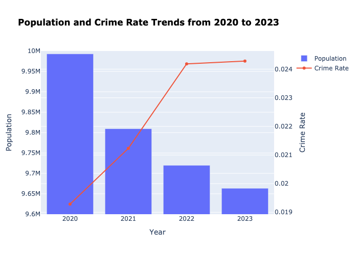

</div>

</div>

<div align='center'>

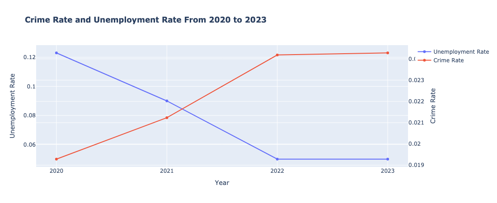

</div>

The crime rate has steadily increased from 2020 through 2023. Other the other hand, the unemployment rate peaked in 2020 at 12.3% during the COVID-19 pandemic and then significantly decreased by 2022 and stabilized in 2023 at 5.0%. The inverse relationship observed suggests complex dynamics between economic indicators and crime. While lower unemployment generally signals economic health, its direct relationship to crime rates can be non-linear and influenced by a multitude of factors.

<div align='center'>

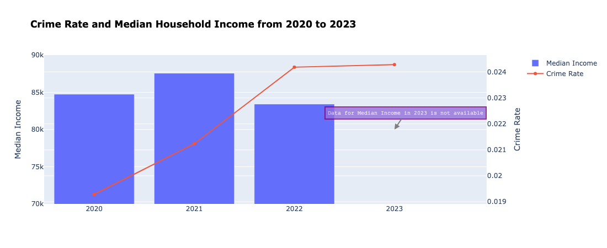

</div>

The data for 2023 median income are not available. There is a fluctuation in median income highlights the uneven impact of the economic recovery after the COVID-period. Consequently, it is not sufficient to tackle the long-term economic challenges, leading to higher crime rates.

The initial recovery in jobs and income post-COVID does not immediately reflect in social stability, as evidenced by rising crime rates. This could point to deeper structural issues in the economy, such as underemployment, income inequality, or a mismatch between high living costs and income in Los Angeles County .

#### **3.2 Temporal Trends**

<div style="display: flex; align-items: flex-start;">
<div style="width: 50%; padding-right: 10px;">

The average number of crime reports across all 24 hours is approximately 36,279, with standard deviation of 12,306. The 95% confidence interval for estimating the mean crime reports per hour more accurately spans from 31,083 to 41,476. This interval shows a statistical estimate where the actual average of hourly crime reports is expected to fall under usual conditions. 

The crime reports from **12 PM to 10 PM**, excepting **1 PM**, exceed the upper bound of the 95% confidence interval. This observation indicates that the afternoon and evening hours tend to have higher crime reports than other hours of the day.
</div>


<div style="width: 50%;">

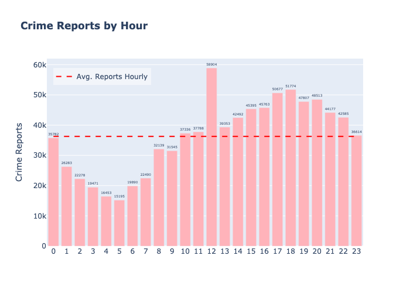

</div>


</div>


<div style="display: flex; align-items: flex-start;">
<div style="width: 50%; padding-right: 10px;">

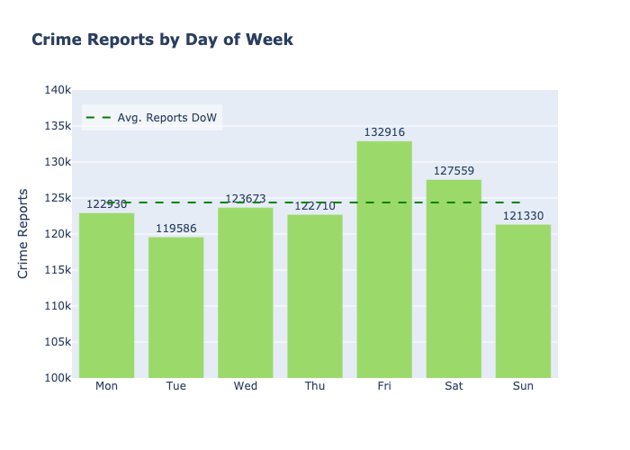

</div>
<div style="width: 50%;">

---

The distribution of crime varies throughout day of week. The mean daily crime report stands at approximately 124,386, with the standard deviation around 4,484. The 95% confidence interval extends from 120,239 to 128,533, framing expectations for typical daily crime figures under usual circumstances.

Crime reports on **Thursday** exceeds the upper confidence limit, suggesting that **Thursdays** see significantly higher crime rates compared to the weekly average. In contrast, **Monday** reports are below the lower confidence limit, indicating a notably lower incidence of crime, potentially reflecting quieter conditions at the start of the week.
</div>

</div>


<div style="display: flex; align-items: flex-start;">

<div style="width: 50%; padding-right: 10px;">

---

Monthly crime reports shows that the average number of reports per month is approximately 72,559, with a standard deviation of 2,272. The 95% confidence interval for the average monthly crime reports is from 71,115 to 74,002.

**July** (75,446 reports), **August** (75,572 reports), and **October** (75,441 reports) are the months where crime reports exceed the upper bound of the confidence interval, indicating these months have significantly higher crime reports than the average. **February** (68,387 reports) falls below the lower bound of the confidence interval, suggesting a notably lower crime rate compared to other months.

</div>
<div style="width: 50%;">

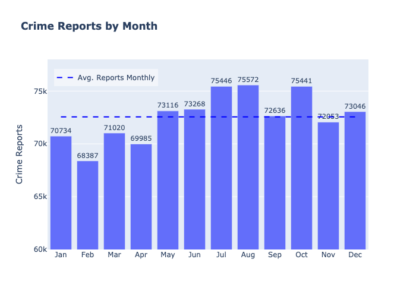

</div>
</div>

---

<div align="center">

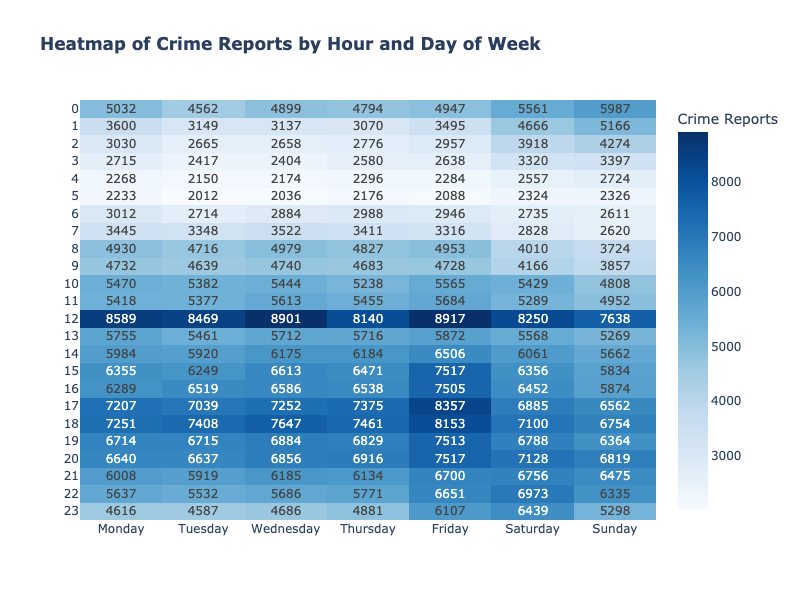

</div>

The heatmap showcases the hourly activity pattern across the week. Observations from the heatmap include:

**Peak Activity**: The heatmap illustrates that the peak activity generally occurs at **12 PM**, accross all days of the week. This is represented by the darker colors that dominate the heatmap around the noon.

**Mid-week Surge**: Crime levels seem to escalate mid-week in the afternoon, specifically from **Wednesday to Friday** from **4 PM to 10 PM**.

**Early Morning Lull**: A consistent pattern of low activity is observed in the early morning hours of weekdays, roughly between **1 AM and 6 AM**. This is represented by the cooler colors prevalent during this period.

This pattern could be linked to increased social and economic activities during afternoons and evenings of mid-week, such as people leaving work/school, increased commercial activities, and higher pedestrian traffic, which may collectively contribute to higher crime rates or reporting frequencies. Understanding these patterns can help law enforcement agencies and policymakers allocate resources more effectively to manage and prevent crime during peak hours. While early morning hours may require less attention.

### **3.3 Location**

Given **870,704** crime reports distributed all over LA county area, traditional point-by-point analysis and visualization become infeasible due to the density of the data. To address this challenge, I have implemented a geographic clustering approach that aggregates crime incidents into manageable clusters based on their physical proximity.

By establishing a grid overlay across the county with a specified grid size of 0.15 degrees for both latitude and longitude, an optimal balance between detail and manageability for data visualization was achieved. This grid size corresponds to approx. 16.65 kilometers per grid cell at the given geographic latitude. Each grid cell represents a cluster in which crime reports are aggregated, allowing for analysis of crime reports.

```
lat_step, lon_step = 0.15, 0.15
lat_cluster = np.round(LAT / lat_step) * lat_step
lon_cluster = np.round(LON / lon_step) * lon_step
```

The clustering algorithm groups all location in Los Angeles County into 15 clusters. The clusters are visualized on the map below, where the size of the cluster is proportional to the number of crime reports, with larger clusters indicating higher crime activity in that area. Red clusters indicate higher crime areas and green clusters indicate lower crime areas.

<div align="center">

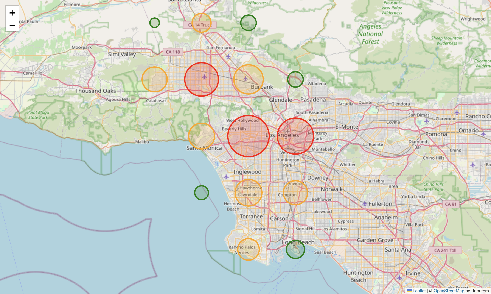

</div>

The heatmap shows that the highest crime reports are concentrated in the central regions of Los Angeles County, including downtown Los Angeles and West Hollywood. This area accounts for approximately **50%** of total crime reports. As clusters move farther from these central hubs, there is a noticeable decline in crime reports. This pattern underscores the geographic distribution of criminal activity, highlighting urban centers as primary points for higher crime rates in comparison to more peripheral areas. Understanding these spatial dynamics can help law enforcement agencies and policymakers target resources more effectively to address crime hotspots and improve public safety in high-risk areas.


### 3.4 Demographics

#### 3.4.1 Gender

<div align="center">

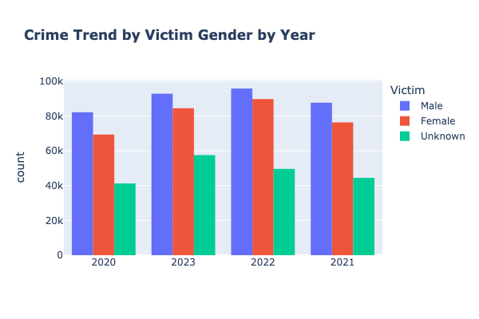

</div>

Overall, the total crime reports rose from 2020 to 2023, the gender distribution shows consistency during this period. Males consistently account for the largest share of crime victims, comprising **41.1%** of the total incidents. Following by Females at **33.7%** and Unknown at **25.2%**. 


<div style="display: flex; align-items: flex-start;">

<div style="width: 50%; padding-right: 10px;">

--- 

The violin chart shows that the age distributions of Males and Females remain consistancy over years, with the majority of crime victims falling between the ages of **25 to 35**. The mean age of Male victims is higher than the mean age of Female victims.

Both the `K-S test` and the `Z test` indicate a significant difference in the age distributions of male and female victims. The K-S test, with test statistic of 0.0701 and a p-value less than 0.05, confirms that the overall age distributions are significantly different. Additionally, the Z test, with a test statistic of 52.853 and a p-value less than 0.05, specifically shows that the average age of male victims is significantly higher than that of female victims.


</div>
<div style="width: 50%;">

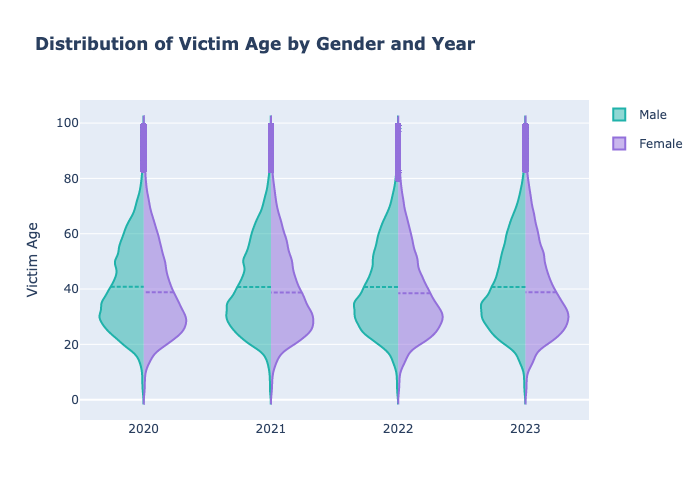

</div>
</div>

#### 3.4.2 Descendance

<div align="center">

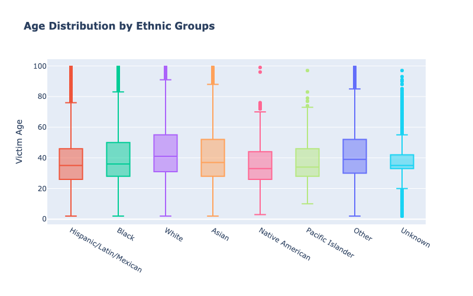

</div>

The age distributions of crime victims looks different across ethnic groups. The boxplot shows that the median age of **White** victims is the highest, with approximately 43 year olds, while the median ages of *Hispanic* and **Native American** victims are the lowest, about 36 years old.

Also, **Asian, Black, and White** groups show higher variance in victim age compared to other groups. This implies within these communities, victim ages are more spread out, indicating that crime affects a broader age range in these groups.

<div style="display: flex; align-items: flex-start;">

<div style="width: 50%; padding-right: 10px;">

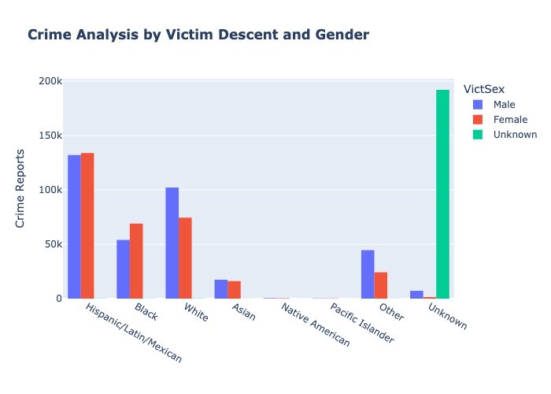

</div>
<div style="width: 50%;">

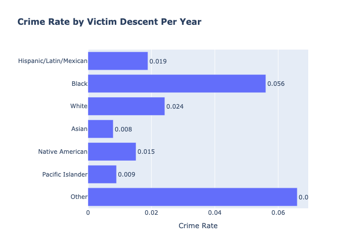

</div>
</div>

It is noticeable that number of male victims is higher than number of females across all ethnic groups, except for  **Hispanic/Latin/Mexican** and **Black**. 

The distribution of crime victims by descendance shows that **Hispanic** and **White** individuals are the most frequent victims of crime, with **Hispanic** victims accounting for **38.6%** of total incidents and **White** victims accounting for **30.1%**. However, **Black** individuals, despite not having the highest total number of crimes, face the highest crime rate at **5.6%**. This suggests that within their population, they are more likely to be victims of crime compared to other groups. In contrast, **Asian** and **Pacific Islander** populations show lowest crime rates (both are less than **1%**).

The observation of a higher number of male victims compared to female victims in most ethnic groups, except for Hispanic/Latin/Mexican and Black, suggesting that cultural norms and social roles might influence vulnerability to crime differently across gender. For instance, males might be more exposed to certain types of incidents because of social expectations that put them in more dangerous situations. However, the differing trends observed in Hispanic/Latin/Mexican and Black communities could indicate social dynamics or varying crime patterns, demonstrating the need for cultural approaches to crime prevention.

Furthermore, the finding that Black individuals face a disproportionately high crime rate despite not having the highest total number of crimes reveals a critical disparity. This emphasizes the need for targeted crime prevention strategies that address the specific challenges within Black communities.


### **3.5 Crime Types**

<div style="display: flex; align-items: flex-start;">

<div style="width: 50%; padding-right: 10px;">

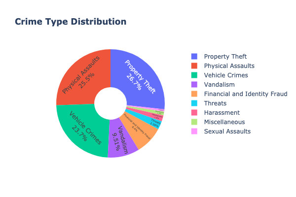

</div>
<div style="width: 50%;">

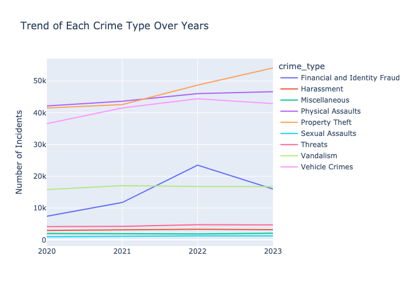

</div>
</div>

**Property Theft**, **Physical Assaults** and **Vehicle Crimes** are the most common types of crime in Los Angeles County, accounting for **26.7%**, **25.5%**, and **23.7%** of total reports respectively. These three crime types together make up **75.9%** of all crime reports in the county. Also, there are an increasing trend from 2020 to 2023 for most frequent crimes types, including **Property Theft** (increases about **31%**), **Physical Assaults** (increases about **10%**), and **Vehicle Crimes** (increases about **16%**). 

It is worth noting that **Financial and Identity Fraud** has the highest increase in crime reports, in 2023 having **more than double** crime reports as in 2020. This significant increase in financial and identity fraud suggests a growing concern for cybercrime and financial scams in the county. The extreme rise in this type of crimes may be due to the increasing reliance on digital transactions and online services, which have created new opportunities for fraudsters to exploit individuals and organizations. This demonstrates the need for more effective cybersecurity defense, public awareness, and law enforcement efforts.


<div align="center">

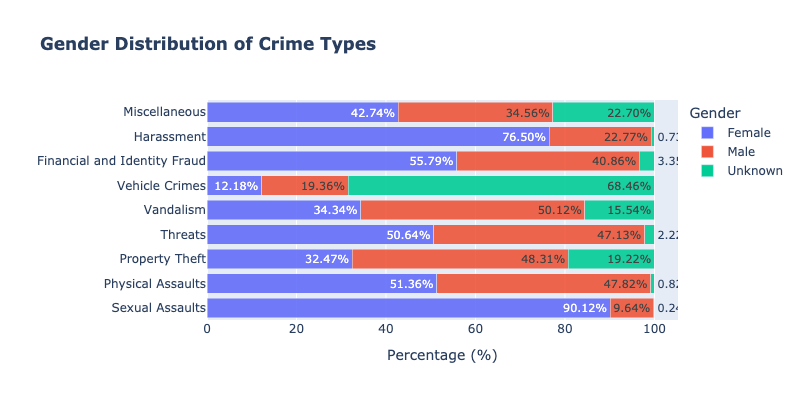

</div>

**Physical Assaults** and **Threats** show a balanced distribution between female and male victims, with a very small fraction of unknown gender. A huge disparity is observed in **sexual assaults**, with females overwhelmingly affected, accouting for **90.12%** of the reports, while males account for just **9.64%**. **Harrasment** is also female-centric, at **76.50%** of the cases, while males are involved in **22.77%** of the cases. This severe imbalance reflects persistent gender-based violence.

<div align="center">

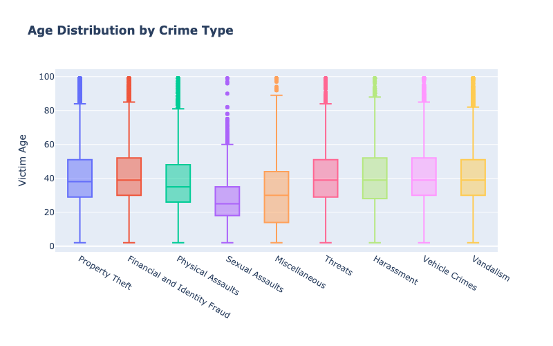

</div>

This boxplot shows that the age is distributed evenly in different crime types, with the median around **40 years old** and standard deviation of **15.4**. However, the average age of victims of sexual assaults is notably lower at **28 years**, which is the lowest among all the crime type.

`Z-test` is applied to compare the average age of sexual assault victims with the average age of victims of other crime types. The test statistic of **-13.6** and p-value less than **0.05** indicate that the average age of sexual assault victims is significantly lower than the average age of victims of other crime types. This emphasizes that younger individuals are more vulnerable to sexual assaults and underscore the urgent need for sexual crime prevention, education, and support, tailored to address the specific risks and needs of younger people. The statistical data provides a starting point for policy makers, educators, and community leaders to formulate strategies that can effectively mitigate the risks and support the victims.

### **4 Conclusion**

The analysis offers a comprehensive exploration of crime in Los Angeles County and underscores the urgent need for targeted interventions that address the root causes of crime, such as socioeconomic disparities, crime hotspots, and high-risk ethinic group. While the increasing crime rate despite a declining population raises concerns, the insights gained from this analysis can inform targeted strategies for crime prevention and reduction. By understanding the temporal, spatial, and demographic patterns of crime, policymakers, law enforcement agencies, and community organizations can work collaboratively to develop and implement effective solutions. Future research should continue to monitor crime trends, evaluate the effectiveness of interventions, and explore emerging challenges, such as the rise of cybercrime. Through continued effort and data-driven approaches, Los Angeles County can aim for a safer community and well-being of its residents.

### **5 Acknowledgements**

This work is modified and developed based on the feedback and guidance through previous presentation. My improvement this work: 
- Enhancing the data visualizations by using different colors or styles to distinguish between various categories more clearly to make the analysis more engaging.
- Including a deeper exploration of the reasons behind the higher victimization rates among specific demographics.
- Looking into the proportion of each demographic group to make a more insightful comparison of crime rates across different groups.
- Deepening the analysis and exploration for crime type.

### **6 Appendix**
[Github Repository](https://github.com/eufouria/crime-analysis-la)
